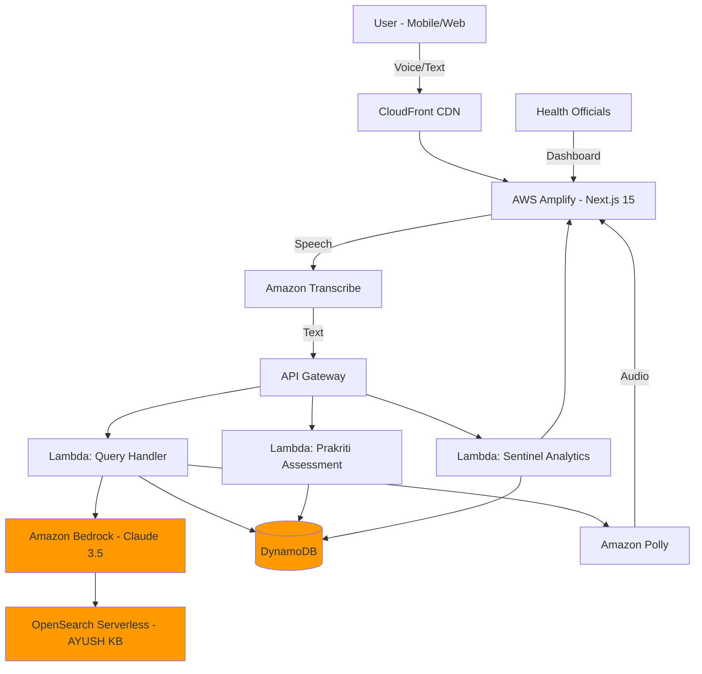

# Design Document: AyushDhara AI

## Overview

AyushDhara AI is a serverless, voice-first healthcare platform that combines ancient AYUSH wisdom with modern AI technology. The system uses Retrieval-Augmented Generation (RAG) to provide grounded health guidance while enabling public health surveillance through anonymized symptom tracking. Built on AWS serverless architecture, the platform ensures scalability, cost-effectiveness, and compliance with Indian data protection regulations.

## Architecture

### High-Level Architecture



### Technology Stack

**Frontend Layer:**
- Next.js 15 (App Router) with React Server Components
- Tailwind CSS for styling with Nature-Tech aesthetic
- Lucide React for iconography
- Recharts for data visualization
- AWS Amplify for hosting and CI/CD

**Backend Layer:**
- AWS Lambda (Node.js 20.x with TypeScript)
- API Gateway (REST API with request validation)
- Amazon Bedrock (Claude 3.5 Sonnet with Guardrails)
- Amazon OpenSearch Serverless (Vector search for RAG)

**Data Layer:**
- Amazon DynamoDB (Single-table design)
- Amazon S3 (AYUSH PDF storage)
- AWS KMS (Encryption key management)

**AI/ML Layer:**
- Amazon Transcribe (Speech-to-Text for Indic languages)
- Amazon Polly (Text-to-Speech with Neural voices)
- Amazon Bedrock Knowledge Bases (RAG implementation)

## Components and Interfaces

### 1. Frontend Components

#### Chat Interface (`/components/Chat.tsx`)

**Purpose:** Voice-first conversational interface for user interactions

**Key Features:**
- Real-time voice input with visual feedback
- Message history with typing indicators
- Glassmorphism design with Nature-Tech aesthetic
- Responsive mobile-first layout
- Language selector for multilingual support

**Props Interface:**
```typescript
interface ChatProps {
  userId: string;
  prakritiProfile?: PrakritiProfile;
  onVoiceStart: () => void;
  onVoiceEnd: (transcript: string) => void;
}
```

#### Prakriti Assessment (`/components/PrakritiQuiz.tsx`)

**Purpose:** Multi-step questionnaire to determine user's Ayurvedic constitution

**Key Features:**
- Progressive disclosure of questions
- Visual representation of Vata/Pitta/Kapha balance
- Score calculation and persistence
- Culturally appropriate imagery

**State Management:**
```typescript
interface QuizState {
  currentQuestion: number;
  answers: Answer[];
  scores: {
    vata: number;
    pitta: number;
    kapha: number;
  };
}
```

#### Sentinel Dashboard (`/components/SentinelMap.tsx`)

**Purpose:** Administrative interface for health officials to monitor symptom patterns

**Key Features:**
- Interactive map with symptom hotspots
- Time-series charts for trend analysis
- Filtering by region, symptom type, and date range
- Export functionality for reports

**Data Interface:**
```typescript
interface SymptomHotspot {
  region: string;
  pincode: string;
  symptomType: string;
  count: number;
  timestamp: number;
  severity: 'low' | 'medium' | 'high';
}
```

### 2. Backend Lambda Functions

#### Query Handler Lambda

**Purpose:** Process user health queries using RAG

**Flow:**
1. Receive query text from API Gateway
2. Retrieve user's Prakriti profile from DynamoDB
3. Query Bedrock Knowledge Base with context
4. Apply Guardrails for safety validation
5. Return grounded response
6. Log anonymized symptom data

**Function Signature:**
```typescript
interface QueryRequest {
  userId: string;
  query: string;
  language: string;
  location?: {
    pincode: string;
    state: string;
  };
}

interface QueryResponse {
  response: string;
  sources: string[];
  audioUrl?: string;
  confidence: number;
}
```

#### Prakriti Assessment Lambda

**Purpose:** Calculate and store user's Ayurvedic constitution

**Algorithm:**
1. Receive quiz answers
2. Calculate weighted scores for Vata/Pitta/Kapha
3. Determine dominant and secondary doshas
4. Generate personalized wellness baseline
5. Store profile in DynamoDB

**Scoring Logic:**
```typescript
interface PrakritiProfile {
  userId: string;
  scores: {
    vata: number;    // 0-100
    pitta: number;   // 0-100
    kapha: number;   // 0-100
  };
  dominant: 'vata' | 'pitta' | 'kapha' | 'balanced';
  secondary?: 'vata' | 'pitta' | 'kapha';
  assessmentDate: string;
}
```

#### Sentinel Analytics Lambda

**Purpose:** Aggregate and analyze symptom data for public health surveillance

**Processing:**
1. Receive anonymized symptom logs
2. Aggregate by region and time window
3. Calculate hotspot severity scores
4. Update DynamoDB analytics table
5. Trigger alerts for unusual patterns

**Anonymization Process:**
- Strip all PII (name, phone, email)
- Hash user IDs with salt
- Retain only pincode (not full address)
- Aggregate to minimum 10 users per region

## Data Models

### DynamoDB Single-Table Design

**Table Name:** `AyushDhara-Main`

**FHIR Compliance Note:** All data models follow FHIR (Fast Healthcare Interoperability Resources) R4 naming conventions to ensure future compatibility with ABDM (Ayushman Bharat Digital Mission). Symptom data is structured to map to FHIR Observation resources, and user profiles align with FHIR Patient resources. This ensures seamless integration with India's national health stack when required.

**Access Patterns:**

| Pattern | PK | SK | GSI |
|---------|----|----|-----|
| User Profile | USER#\{userId\} | PROFILE | - |
| Prakriti Data | USER#\{userId\} | PRAKRITI#\{timestamp\} | - |
| Query History | USER#\{userId\} | QUERY#\{timestamp\} | - |
| Symptom Hotspot | REGION#\{pincode\} | SYMPTOM#\{type\}#\{date\} | GSI1: SYMPTOM#\{type\} |
| Wellness Plan | USER#\{userId\} | PLAN#\{date\} | - |

**Entity Schemas:**

```typescript
// User Profile
interface UserEntity {
  PK: string;              // USER#{userId}
  SK: string;              // PROFILE
  userId: string;
  language: string;
  createdAt: string;
  consentGiven: boolean;
  encryptedData?: string;  // KMS encrypted PII
}

// Prakriti Profile
interface PrakritiEntity {
  PK: string;              // USER#{userId}
  SK: string;              // PRAKRITI#{timestamp}
  scores: {
    vata: number;
    pitta: number;
    kapha: number;
  };
  dominant: string;
  assessmentDate: string;
}

// Symptom Hotspot (Anonymized)
interface SymptomEntity {
  PK: string;              // REGION#{pincode}
  SK: string;              // SYMPTOM#{type}#{date}
  symptomType: string;
  count: number;
  severity: string;
  date: string;
  GSI1PK: string;          // SYMPTOM#{type}
  GSI1SK: string;          // DATE#{date}
}
```

### Amazon Bedrock Knowledge Base Structure

**Document Format:**
- Source: Ministry of AYUSH verified PDFs
- Chunking: 500-token chunks with 50-token overlap
- Embedding Model: Amazon Titan Embeddings G1
- Vector Dimensions: 1536

**Metadata Schema:**
```typescript
interface DocumentMetadata {
  source: string;          // PDF filename
  category: string;        // Prakriti type, symptom, remedy
  language: string;        // hi, en, ta
  verifiedBy: string;      // Ministry authority
  lastUpdated: string;
  relevanceScore?: number;
}
```

## Correctness Properties

*A property is a characteristic or behavior that should hold true across all valid executions of a system—essentially, a formal statement about what the system should do. Properties serve as the bridge between human-readable specifications and machine-verifiable correctness guarantees.*

### Property 1: Prakriti Assessment Consistency

*For any* user completing the Prakriti assessment with the same answers, the system should produce identical Prakriti scores and dominant dosha classification.

**Validates: Requirements 1.3, 1.4**

### Property 2: RAG Response Grounding

*For any* health query, all AI-generated responses must contain at least one citation from the AYUSH Knowledge Base, ensuring zero hallucination.

**Validates: Requirements 2.1, 2.2**

### Property 3: PII Anonymization Completeness

*For any* symptom data stored for public health analytics, the data must not contain any personally identifiable information (name, phone, email, full address).

**Validates: Requirements 7.3, 4.4**

### Property 4: Voice Round-Trip Accuracy

*For any* supported Indic language, transcribing speech to text and then synthesizing back to speech should preserve the semantic meaning of the original input.

**Validates: Requirements 3.1, 3.2**

### Property 5: Response Time Constraint

*For any* user query under normal load conditions, the total round-trip time from query submission to response delivery should be less than 3 seconds.

**Validates: Requirements 8.1**

### Property 6: Multilingual Context Preservation

*For any* conversation where the user switches languages mid-session, the system should maintain conversation context and Prakriti profile consistency.

**Validates: Requirements 3.4**

### Property 7: Hotspot Aggregation Accuracy

*For any* set of symptom reports from a region, the aggregated count in the Sentinel Dashboard should equal the sum of individual anonymized reports for that region and time period.

**Validates: Requirements 4.2**

### Property 8: Wellness Plan Personalization

*For any* two users with different Prakriti profiles, the generated wellness plans should differ in at least one dietary or lifestyle recommendation.

**Validates: Requirements 5.1, 5.2**

### Property 9: Guardrail Safety Enforcement

*For any* query requesting non-AYUSH medical advice or unsafe practices, the Bedrock Guardrails should block the response and redirect to qualified practitioners.

**Validates: Requirements 2.3, 2.4**

### Property 10: Data Encryption at Rest

*For any* user data containing PII stored in DynamoDB, the data must be encrypted using AWS KMS with user-specific encryption keys.

**Validates: Requirements 7.2**

### Property 11: Seasonal Adaptation

*For any* wellness plan generated during different seasons (Ritucharya periods), the dietary recommendations should reflect seasonal food availability and Ayurvedic seasonal guidelines.

**Validates: Requirements 5.2, 5.4**

### Property 12: Auto-Scaling Behavior

*For any* traffic spike exceeding baseline by 10x, the Lambda functions should automatically scale to handle the load without manual intervention.

**Validates: Requirements 6.2**

## Error Handling

### Frontend Error Handling

**Voice Input Errors:**
- Microphone permission denied → Show permission request modal
- Speech recognition timeout → Provide text input fallback
- Network connectivity issues → Queue requests for retry

**API Errors:**
- 429 Rate Limit → Show "High traffic, please wait" message
- 500 Server Error → Graceful degradation with cached responses
- 403 Unauthorized → Redirect to authentication

### Backend Error Handling

**Lambda Function Errors:**
- DynamoDB throttling → Implement exponential backoff
- Bedrock timeout → Return cached similar response
- OpenSearch unavailable → Fallback to basic keyword search

**Data Validation:**
- Invalid Prakriti scores → Reject with specific error message
- Malformed query → Sanitize and retry
- Missing required fields → Return 400 with field details

### Monitoring and Alerting

**CloudWatch Metrics:**
- Lambda invocation errors > 1% → Alert DevOps
- API Gateway 5xx errors > 0.5% → Alert DevOps
- DynamoDB consumed capacity > 80% → Auto-scale trigger
- Bedrock response time > 2s → Performance alert

## Testing Strategy

### Unit Testing

**Frontend Components:**
- Test Chat component rendering with different states
- Test Prakriti quiz score calculation logic
- Test Sentinel Dashboard data visualization
- Test voice input/output UI feedback

**Backend Functions:**
- Test Lambda handler input validation
- Test Prakriti calculation algorithm
- Test anonymization logic
- Test DynamoDB query builders

### Property-Based Testing

**Framework:** fast-check (for TypeScript/JavaScript)

**Configuration:**
- Minimum 100 iterations per property test
- Random seed logging for reproducibility
- Shrinking enabled for minimal counterexamples

**Property Test Examples:**

```typescript
// Property 1: Prakriti Assessment Consistency
test('Feature: ayushdhara-ai, Property 1: Prakriti assessment consistency', () => {
  fc.assert(
    fc.property(
      fc.array(fc.record({
        questionId: fc.integer(1, 10),
        answer: fc.integer(1, 5)
      })),
      (answers) => {
        const result1 = calculatePrakriti(answers);
        const result2 = calculatePrakriti(answers);
        return deepEqual(result1, result2);
      }
    ),
    { numRuns: 100 }
  );
});

// Property 3: PII Anonymization Completeness
test('Feature: ayushdhara-ai, Property 3: PII anonymization completeness', () => {
  fc.assert(
    fc.property(
      fc.record({
        userId: fc.uuid(),
        name: fc.string(),
        phone: fc.string(),
        email: fc.emailAddress(),
        symptom: fc.string(),
        pincode: fc.string(6, 6)
      }),
      (userData) => {
        const anonymized = anonymizeForAnalytics(userData);
        return (
          !anonymized.hasOwnProperty('name') &&
          !anonymized.hasOwnProperty('phone') &&
          !anonymized.hasOwnProperty('email') &&
          !anonymized.hasOwnProperty('userId') &&
          anonymized.hasOwnProperty('pincode')
        );
      }
    ),
    { numRuns: 100 }
  );
});
```

### Integration Testing

**End-to-End Flows:**
- Complete Prakriti assessment flow
- Voice query to response pipeline
- Symptom logging to dashboard update
- Multi-language conversation flow

**AWS Service Integration:**
- Bedrock Knowledge Base retrieval accuracy
- DynamoDB read/write operations
- API Gateway request/response validation
- Transcribe/Polly voice processing

### Performance Testing

**Load Testing:**
- Simulate 1000 concurrent users
- Test Lambda cold start times
- Measure API Gateway latency
- Verify auto-scaling behavior

**Benchmarks:**
- Query response time: < 3 seconds (p95)
- Prakriti assessment: < 1 second
- Dashboard load time: < 2 seconds
- Voice round-trip: < 4 seconds

## Security Considerations

### Authentication and Authorization

- AWS Cognito for user authentication
- JWT tokens for API authorization
- Role-based access control for admin dashboard
- API key rotation for external integrations

### Data Protection

- Encryption in transit (TLS 1.3)
- Encryption at rest (AWS KMS)
- PII redaction before analytics
- DPDP Act 2023 compliance

### API Security

- Rate limiting (100 requests/minute per user)
- Input validation and sanitization
- CORS configuration for allowed origins
- WAF rules for common attack patterns

## Deployment Strategy

### Infrastructure as Code

**AWS CDK Stack Structure:**
```
- NetworkStack (VPC, Subnets)
- DataStack (DynamoDB, S3)
- ComputeStack (Lambda functions)
- AIStack (Bedrock, OpenSearch)
- FrontendStack (Amplify)
```

### CI/CD Pipeline

**GitHub Actions Workflow:**
1. Code commit triggers pipeline
2. Run unit tests and linting
3. Build Next.js application
4. Deploy Lambda functions
5. Update Bedrock Knowledge Base
6. Deploy frontend to Amplify
7. Run integration tests
8. Promote to production

### Multi-Environment Setup

- **Dev:** Single AZ, minimal resources
- **Staging:** Multi-AZ, production-like
- **Production:** Multi-AZ, auto-scaling enabled

## Scalability and Performance

### Caching Strategy

- CloudFront CDN for static assets
- API Gateway response caching (5 minutes)
- DynamoDB DAX for hot data
- Client-side caching for Prakriti profiles

### Database Optimization

- DynamoDB on-demand pricing for variable load
- GSI for efficient query patterns
- TTL for automatic data expiration
- Point-in-time recovery enabled

### Cost Optimization

- Lambda reserved concurrency for predictable workloads
- S3 Intelligent-Tiering for AYUSH PDFs
- OpenSearch Serverless for automatic scaling
- CloudWatch Logs retention policies

## Future Enhancements

1. **Telemedicine Integration:** Connect users with certified AYUSH practitioners
2. **Wearable Device Integration:** Sync health data from fitness trackers
3. **Community Features:** User forums for wellness journey sharing
4. **Advanced Analytics:** Predictive modeling for disease outbreak forecasting
5. **Offline Mode:** Progressive Web App with offline Prakriti assessment